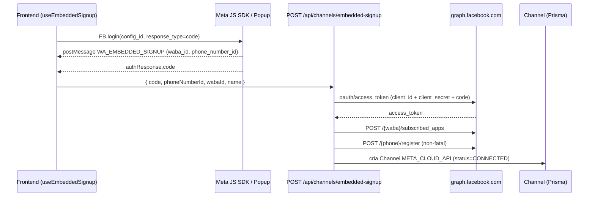

# Onboarding — WhatsApp Cloud API via Embedded Signup

Setup do canal WhatsApp usando o **Embedded Signup** da Meta (Login for
Business). O cliente conecta a própria conta WhatsApp Business (WABA) com um
clique em "Conectar com Facebook" — sem colar token, sem mexer no painel Meta.

O App Meta do CRM é o mesmo para todos os clientes (multi-tenant). A Meta
entrega os webhooks de todos os WABAs assinados no **Callback URL global** do
App; o handler resolve a organização a partir do payload.

## Visão geral do fluxo



## 1. Configuração Meta (uma vez, no App do CRM)

Feito uma única vez pela equipe do CRM. O App precisa estar **Live** com App
Review aprovado.

1. Acesse `https://developers.facebook.com/apps/` e abra o App do CRM.
2. Em **Products**, adicione **WhatsApp** e **Facebook Login for Business**.
3. Em **Facebook Login for Business > Configurations > Create configuration**:
   - Login variation: **Business login** / caso de uso: **WhatsApp Embedded
     Signup**.
   - Permissões: `whatsapp_business_management`, `whatsapp_business_messaging`
     (e `business_management` se o fluxo pedir).
   - Salve e copie o `Configuration ID` para `NEXT_PUBLIC_META_ES_CONFIG_ID`.
4. Em **App Settings > Basic**, copie o **App ID** e o **App Secret**:
   - `NEXT_PUBLIC_META_APP_ID` = App ID
   - `META_APP_SECRET` = App Secret (backend — usado na troca `code`→token e
     na verificação de assinatura dos webhooks).
5. Em **WhatsApp > Configuration > Webhook (Callback URL)**:

   ```
   https://<backend>/api/webhooks/meta/<orgSlug>
   ```

   Em canais criados por Embedded Signup, o CRM assina o app ao WABA
   automaticamente (`subscribed_apps`) — o cliente **não** precisa colar
   Callback URL. O Verify Token global é `META_WEBHOOK_VERIFY_TOKEN`.
   Campos: `messages` (e `calls` se usar ligações).
6. App Review: solicite `whatsapp_business_management` e
   `whatsapp_business_messaging` e publique o App (**Live**).

## 2. Fluxo do usuário no CRM

1. `/settings/channels > Novo canal > WhatsApp > Conectar com Facebook`.
2. O SDK abre o popup do Embedded Signup (`FB.login` com `config_id`,
   `response_type=code`). O cliente escolhe/cria o Business, a WABA e o número.
3. O popup emite `postMessage` `WA_EMBEDDED_SIGNUP` com `waba_id` e
   `phone_number_id`, e o `FB.login` retorna o `code`.
4. Frontend chama `POST /api/channels/embedded-signup` com
   `{ code, phoneNumberId, wabaId, name }`.
5. Backend (`src/services/channels-meta-provision.ts`):
   - troca `code`→`access_token`;
   - `POST /{waba}/subscribed_apps` (assina o app do CRM ao WABA);
   - `POST /{phone}/register` (non-fatal — define PIN de 2 etapas);
   - busca `display_phone_number`/`verified_name`;
   - cria `Channel` `provider=META_CLOUD_API`, `config.embeddedSignup=true`,
     `status=CONNECTED`.

Reconexão: em canais já criados via ES, o painel
(`meta-config-panel.tsx`) oferece "Reconectar com Facebook", que reenvia o
fluxo passando `channelId` (atualiza o token em vez de criar canal novo).

## 3. Validação pós-signup (health-check)

- A resposta do `POST /api/channels/embedded-signup` inclui
  `webhookSubscribed`, `phoneRegistered`, `displayPhone`, `verifiedName`.
  Se `phoneRegistered=false`, a UI avisa que o número ainda precisa de
  registro/PIN para **enviar** (o recebimento já funciona).
- Diagnóstico sob demanda: `GET /api/channels/[id]/meta-health` consulta
  `subscribed_apps` (webhook ativo) + saúde do número
  (`code_verification_status`, `quality_rating`).

## 4. Resolução do canal no webhook

A rota scoped `/api/webhooks/meta/<orgSlug>` resolve a organização pelo slug
na URL; dentro, o canal é resolvido pelo `metadata.phone_number_id` do payload
(match em `Channel.config.phoneNumberId`). A assinatura `x-hub-signature-256` é
validada com o `META_APP_SECRET` global do CRM (canais ES **não** gravam
`appSecret` próprio).

## 5. Variáveis de ambiente

| Var | Onde | Uso |
|-----|------|-----|
| `NEXT_PUBLIC_META_APP_ID` | frontend+backend | App ID lido pelo SDK e na troca de token |
| `NEXT_PUBLIC_META_ES_CONFIG_ID` | frontend | `config_id` do Embedded Signup |
| `META_APP_SECRET` | backend | troca `code`→token + assinatura dos webhooks |
| `META_WEBHOOK_VERIFY_TOKEN` | backend | handshake GET do webhook |
| `KEYRING_SECRET` | backend | encripta `accessToken` em `Channel.config` |

Sem `META_APP_SECRET` no deploy, a troca de token falha e os webhooks são
recusados (o canal fica "criado" mas mudo). Confirme que
`GET /api/config/public` retorna `embeddedSignupConfigured: true`.

## 6. Troubleshooting

| Sintoma | Causa provável | Ação |
|---------|----------------|------|
| Botão "Conectar com Facebook" não aparece | `NEXT_PUBLIC_META_APP_ID` ou `NEXT_PUBLIC_META_ES_CONFIG_ID` ausente | Setar no `.env`; checar `/api/config/public` |
| Erro "Não foi possível assinar o webhook no WABA" | Permissões `whatsapp_business_management` faltando / token sem escopo | Revisar Configuration ID e App Review |
| Canal criado mas mensagens não chegam | App não assinado ao WABA | `GET /api/channels/[id]/meta-health` → `webhookSubscribed`; rodar `subscribe-waba.mjs` |
| Recebe mas não envia | `phoneRegistered=false` (número sem PIN) | Registrar número / definir PIN de 2 etapas no painel Meta |
| Webhook retorna 401/403 | `META_APP_SECRET` ausente ou divergente | Setar o App Secret correto no backend |
